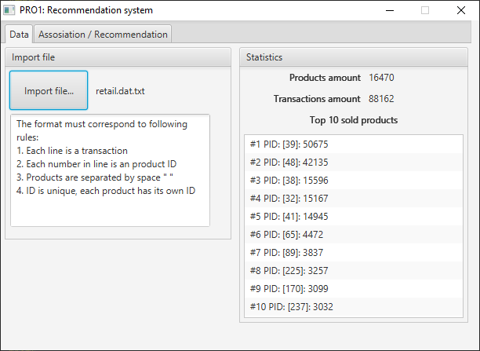
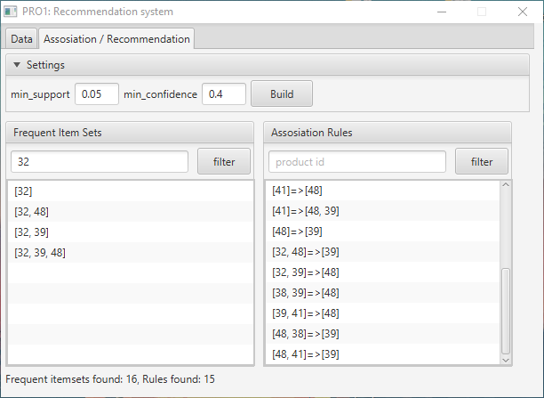
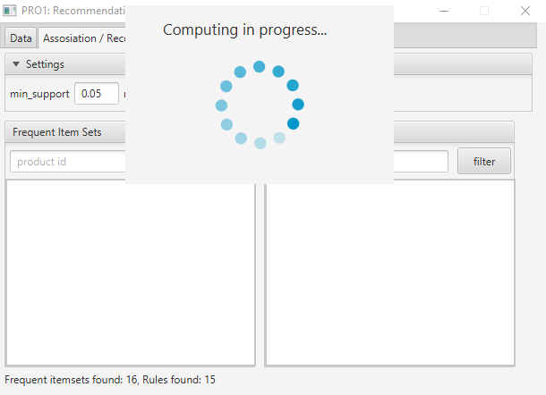

# PRO1: Recommendation System
First project of Intelligent data processing systems specialisation
# Goal
Using the *Apriori* algorithm to search for association rules in the transaction database of a certain trading portal. The goal is to **create recommendations and suggestions for customers** to buy more matched products.
# Dataset
The example dataset is located in `res/retail.dat.txt`
# Screenshots

